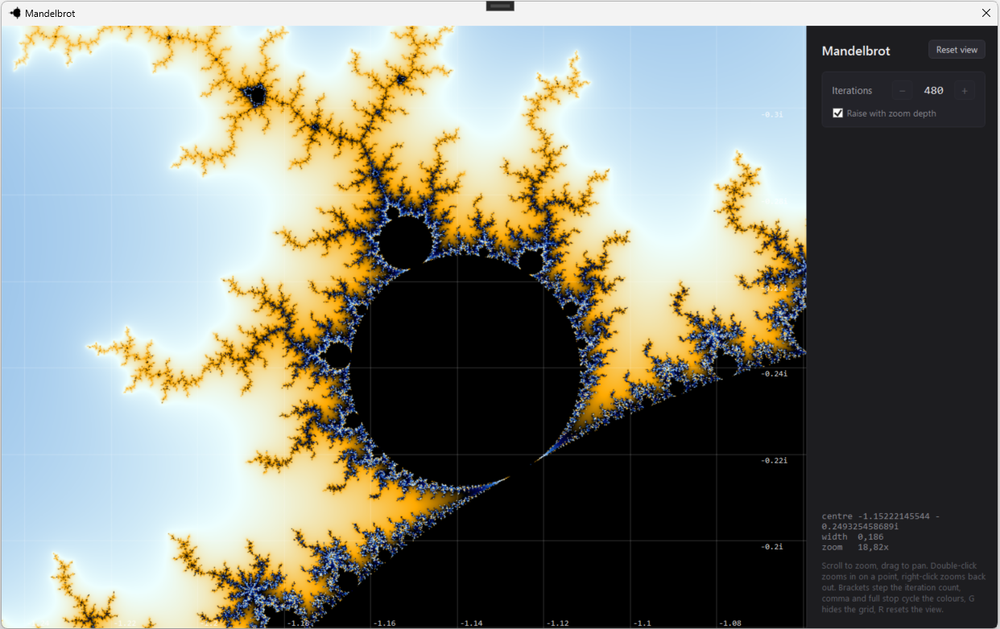

# Fractals

Small WPF apps that draw fractals on the GPU through ILGPU. Two so far: a Newton fractal you edit by dragging roots around, and the Mandelbrot set.

## Newton fractal

<!-- Drop a screenshot at Docs/newton.png -->


You move the roots around with the mouse and the picture updates as you drag. Inspired by [this 3Blue1Brown video](https://www.youtube.com/watch?v=-RdOwhmqP5s).

### What a Newton fractal is

Newton–Raphson is the old method for finding a root of a function. You start with a guess and repeat:

$$
z = z - f(z) / f'(z)
$$

After enough steps the guess usually lands on a root. Which root it lands on depends on where you started.

That is the whole idea behind the picture. Every pixel is a point on the complex plane, and that point is used as the starting guess. The iteration runs, a root comes out, and the pixel is painted in that root's colour. All the points that end up at the same root form a basin.

If the basins were simple shapes this would be boring. They are not. Near the edges, two starting points a pixel apart can end at different roots, and the boundary between any two basins turns out to contain points of every other basin as well. Zoom in anywhere along an edge and the same tangle keeps appearing.

The polynomial here is built from the roots rather than typed in as coefficients. Place three roots and you get a cubic, place five and you get a quintic. Up to eight are allowed.

### How the picture is drawn

One GPU thread per pixel.

1. Convert the pixel to a complex number using the current centre and zoom.
2. Iterate from there, up to the iteration limit, stopping early once a step gets small enough.
3. Find the nearest root to wherever it stopped and take that root's colour.
4. Darken the colour according to how many steps it took.

The shading is what gives the bands. Points sitting right on a root converge immediately and stay bright. Points near a basin boundary dither about for a long time first, so they come out dark.

The iteration count is worth playing with. Set it to zero and no iteration happens at all, so each pixel is just coloured by the root it is closest to, which gives plain straight-edged regions. Raise it one step at a time and you can watch the fractal grow out of those regions.

### Controls

| Action | Effect |
| --- | --- |
| Drag a marker | Move that root |
| Double-click empty space | Add a root there |
| Right-click a marker | Remove that root |
| Drag elsewhere | Pan |
| Scroll | Zoom on the cursor |
| `[` and `]` | Lower or raise the iteration count |
| `R` | Reset the view |
| `Ctrl+R` | Reset the roots |

The side panel lists the roots with their colours and current values, and has buttons for adding and removing them.

Roots keep their colour when others are added or removed, so a basin does not change colour underneath you while you are editing.

### Limits

- Eight roots at most, which is both the polynomial degree limit and the size of the palette.
- Iterations run from 0 to 1000.
- Zoom stops at about 1e-6 units per pixel. The maths is single precision, so past that the picture breaks up.

## Mandelbrot set

<!-- Drop a screenshot at Docs/mandelbrot.png -->


Nothing to edit here. It is one fixed picture, and the whole app is about moving around inside it.

### What the Mandelbrot set is

Take a complex number $c$, start at zero and repeat:

$$
z = z^2 + c
$$

For some values of $c$ the sequence stays bounded forever. For the rest it eventually runs off to infinity. The set is the collection of values that stay bounded, and it is drawn black.

The interesting part is everything else. Points outside the set escape, but they take their time about it: right next to the boundary a point may loop around for thousands of steps before it gets away, while a point further out is gone in three. Colouring each pixel by how long it took is what produces the bands, and the boundary those bands wrap around is endlessly detailed. Every zoom reveals more of it, and small distorted copies of the whole set keep turning up in the filaments.

There is no closed form for the boundary and no way to prove a point is inside it in finite time. Everything is a budget: iterate up to some limit, and if the point has not escaped by then, call it black. Which means the boundary in the picture is really "the boundary as far as the iteration count can see", and raising the count sharpens it.

### How the picture is drawn

One GPU thread per pixel again, but the shape of the work is different: instead of one basin lookup at the end, each pixel runs the same squaring loop until it escapes or runs out of budget.

1. Convert the pixel to a complex number, and use that as $c$.
2. Check the two large interior lobes first. The main cardioid and the period-2 bulb both have closed-form membership tests, so pixels inside them skip the loop entirely. That is most of the black area and most of the frame time.
3. Otherwise iterate until $|z|$ passes the escape radius or the iteration limit runs out.
4. Colour by how long it took, or paint black if it never escaped.

A raw escape count is an integer, which would split the picture into hard steps. Subtracting $\log_2(\log|z|)$ recovers the fraction of a step the point overshot by, so the colours run continuously instead. Escape times also crowd together near the boundary and spread out away from it, so the smooth count is passed through a square root before it indexes the palette, which keeps the bands about as wide near the edge as they are further out.

The palette is a gradient that wraps, so it can be rotated with the comma and full stop keys without any seam.

Iterations matter far more here than in the Newton viewer, because each decade of zoom pulls out thinner filaments that need more steps to resolve. The count rises with zoom depth automatically, roughly 220 extra per decade. Untick that in the panel and the stepper goes back to being manual.

### Controls

| Action | Effect |
| --- | --- |
| Scroll | Zoom on the cursor |
| Double-click | Zoom in on that point |
| Right-click | Zoom back out |
| Drag | Pan |
| `[` and `]` | Lower or raise the iteration count |
| `,` and `.` | Rotate the palette |
| `G` | Hide the grid |
| `R` | Reset the view |

### Limits

- Iterations run from 1 to 10000.
- Zoom stops at about 1e-15 units per pixel. The maths is double precision here rather than single, so there is a lot more room than in the Newton viewer, but the same wall is there in the end. Going deeper needs perturbation with arbitrary-precision reference orbits, which is a much larger job.
- Double-precision throughput on consumer NVIDIA cards is a fraction of single, so frames are slower than the Newton viewer's despite the simpler loop.

## Building

Windows, .NET 9, WPF. ILGPU picks the best available device and falls back to the CPU if there is no usable GPU.

```
dotnet build
dotnet run
```

The Mandelbrot viewer also references ILGPU.Algorithms, for the logarithms the smooth colouring needs inside the kernel.

## Coming later

More fractals are planned. The renderer and the WPF shell are already separate from the fractal-specific parts, so each new one slots in beside the others rather than replacing them. Julia sets are next, and they share most of the Mandelbrot renderer: the same squaring loop, but $c$ is fixed and the pixel becomes the starting $z$.