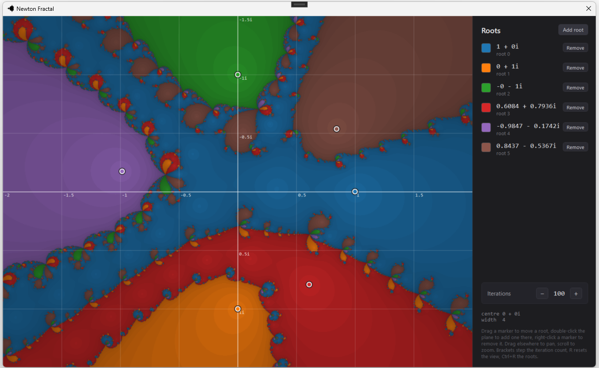

# Newton Fractal

<!-- Drop a screenshot at docs/screenshot.png -->


A small WPF app that draws Newton fractals on the GPU. You move the roots around with the mouse and the picture updates as you drag. Inspired by .

## What a Newton fractal is

Newton–Raphson is the old method for finding a root of a function. You start with a guess and repeat:

$$
z = z - f(z) / f'(z)
$$

After enough steps the guess usually lands on a root. Which root it lands on depends on where you started.

That is the whole idea behind the picture. Every pixel is a point on the complex plane, and that point is used as the starting guess. The iteration runs, a root comes out, and the pixel is painted in that root's colour. All the points that end up at the same root form a basin.

If the basins were simple shapes this would be boring. They are not. Near the edges, two starting points a pixel apart can end at different roots, and the boundary between any two basins turns out to contain points of every other basin as well. Zoom in anywhere along an edge and the same tangle keeps appearing.

The polynomial here is built from the roots rather than typed in as coefficients. Place three roots and you get a cubic, place five and you get a quintic. Up to eight are allowed.

## How the picture is drawn

One GPU thread per pixel, through ILGPU.

1. Convert the pixel to a complex number using the current centre and zoom.
2. Iterate from there, up to the iteration limit, stopping early once a step gets small enough.
3. Find the nearest root to wherever it stopped and take that root's colour.
4. Darken the colour according to how many steps it took.

The shading is what gives the bands. Points sitting right on a root converge immediately and stay bright. Points near a basin boundary dither about for a long time first, so they come out dark.

The iteration count is worth playing with. Set it to zero and no iteration happens at all, so each pixel is just coloured by the root it is closest to, which gives plain straight-edged regions. Raise it one step at a time and you can watch the fractal grow out of those regions.

## Controls

| Action | Effect |
| --- | --- |
| Drag a marker | Move that root |
| Double-click empty space | Add a root there |
| Right-click a marker | Remove that root |
| Drag elsewhere | Pan |
| Scroll | Zoom on the cursor |
| `[` and `]` | Lower or raise the iteration count |
| `R` | Reset the view |
| `Ctrl+R` | Reset the roots |

The side panel lists the roots with their colours and current values, and has buttons for adding and removing them.

Roots keep their colour when others are added or removed, so a basin does not change colour underneath you while you are editing.

## Limits

- Eight roots at most, which is both the polynomial degree limit and the size of the palette.
- Iterations run from 0 to 1000.
- Zoom stops at about 1e-6 units per pixel. The maths is single precision, so past that the picture breaks up.

## Building

Windows, .NET 9, WPF. ILGPU picks the best available device and falls back to the CPU if there is no usable GPU.

```
dotnet build
dotnet run
```

## Coming later

More fractals are planned. The renderer and the WPF shell are already separate from the Newton-specific parts, so the next ones (Mandelbrot and Julia first) slot in beside this one rather than replacing it.